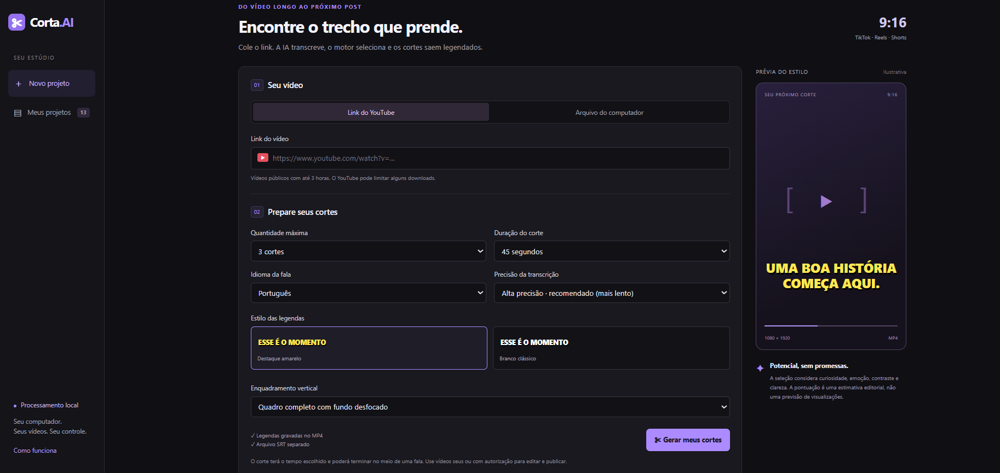

# ✂️ Corta.AI — Cortes Automáticos de Vídeo

Ferramenta desenvolvida para automatizar a criação de cortes verticais a partir de vídeos longos, com transcrição, seleção de trechos, legendas e preparação de conteúdo para redes sociais.

## ✨ Funcionalidades

- 🎬 Importação por link do YouTube ou arquivo local
- ✂️ Geração automática de múltiplos cortes
- ⏱️ Seleção da duração dos vídeos
- 📝 Transcrição e criação de legendas
- 🎨 Estilos diferentes de legenda
- 📱 Formato vertical 9:16
- 🖼️ Enquadramento com fundo desfocado
- 💻 Processamento local
- 🤖 Análise de trechos com apoio de IA
- 📄 Geração de arquivo SRT separado

## 🛠️ Tecnologias

## 🔒 Processamento local

O Corta.AI foi desenvolvido para executar o processamento no próprio computador, mantendo os arquivos e vídeos sob controle do usuário.

## 💡 Objetivo

Reduzir o trabalho manual necessário para transformar vídeos longos em conteúdos curtos e prontos para plataformas como Reels, TikTok e Shorts.
